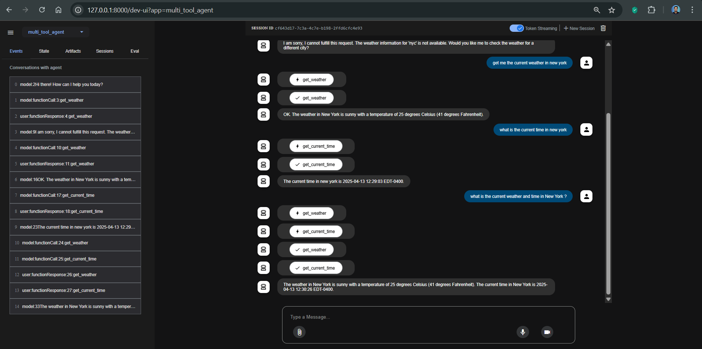

Agent Development Kit

URL Source: https://google.github.io/adk-docs/get-started/quickstart/

Markdown Content:
This quickstart guides you through installing the Agent Development Kit (ADK), setting up a basic agent with multiple tools, and running it locally either in the terminal or in the interactive, browser-based dev UI.

This quickstart assumes a local IDE (VS Code, PyCharm, etc.) with Python 3.9+ and terminal access. This method runs the application entirely on your machine and is recommended for internal development.

## 1\. Set up Environment & Install ADK

Create & Activate Virtual Environment (Recommended):

```
# Create
python-mvenv.venv
# Activate (each new terminal)
# macOS/Linux: source .venv/bin/activate
# Windows CMD: .venv\Scripts\activate.bat
# Windows PowerShell: .venv\Scripts\Activate.ps1
```

Install ADK:

```
pip install google-adk
```

## 2\. Create Agent Project

### Project structure

You will need to create the following project structure:

```
parent_folder/
    multi_tool_agent/
        __init__.py
        agent.py
        .env
```

Create the folder `multi_tool_agent`:

```
mk dir multi_tool_agent/
```

Note for Windows users

When using ADK on Windows for the next few steps, we recommend creating Python files using File Explorer or an IDE because the following commands (`mkdir`, `echo`) typically generate files with null bytes and/or incorrect encoding.

### `__init__.py`

Now create an `__init__.py` file in the folder:

```
echo "from . import agent" > multi_tool_agent/__init__.py
```

Your `__init__.py` should now look like this:

multi_tool_agent/\_\_init\_\_.py

```
from . import agent
```

### `agent.py`

Create an `agent.py` file in the same folder:

```
touch multi_tool_agent/agent.py
```

Copy and paste the following code into `agent.py`:

multi_tool_agent/agent.py

```
importdatetime
fromzoneinfoimport ZoneInfo
fromgoogle.adk.agentsimport Agent

defget_weather(city: str) -> dict:
"""Retrieves the current weather report for a specified city.

    Args:
        city (str): The name of the city for which to retrieve the weather report.

    Returns:
        dict: status and result or error msg.
    """
    if city.lower() == "new york":
        return {
            "status": "success",
            "report": (
                "The weather in New York is sunny with a temperature of 25 degrees"
                " Celsius (41 degrees Fahrenheit)."
            ),
        }
    else:
        return {
            "status": "error",
            "error_message": f"Weather information for '{city}' is not available.",
        }


defget_current_time(city: str) -> dict:
"""Returns the current time in a specified city.

    Args:
        city (str): The name of the city for which to retrieve the current time.

    Returns:
        dict: status and result or error msg.
    """

    if city.lower() == "new york":
        tz_identifier = "America/New_York"
    else:
        return {
            "status": "error",
            "error_message": (
                f"Sorry, I don't have timezone information for {city}."
            ),
        }

    tz = ZoneInfo(tz_identifier)
    now = datetime.datetime.now(tz)
    report = (
        f'The current time in {city} is {now.strftime("%Y-%m-%d %H:%M:%S %Z%z")}'
    )
    return {"status": "success", "report": report}


root_agent = Agent(
    name="weather_time_agent",
    model="gemini-2.0-flash",
    description=(
        "Agent to answer questions about the time and weather in a city."
    ),
    instruction=(
        "You are a helpful agent who can answer user questions about the time and weather in
    ),
    tools=[get_weather, get_current_time],
)
```

### `.env`

Create a `.env` file in the same folder:

```
touch multi_tool_agent/.env
```

You can just copy and paste the following code for now, as more instructions are describe in the next section on [Set up the model](https://google.github.io/adk-docs/get-started/quickstart/#set-up-the-model).

multi_tool_agent/.env

```
# If using Gemini via Google AI Studio
GOOGLE_GENAI_USE_VERTEXAI="False"
GOOGLE_API_KEY="paste-your-actual-key-here"

# # If using Gemini via Vertex AI on Google CLoud
# GOOGLE_CLOUD_PROJECT="your-project-id"
# GOOGLE_CLOUD_LOCATION="your-location" #e.g. us-central1
# GOOGLE_GENAI_USE_VERTEXAI="True"
```


## 3\. Set up the model

Your agent's ability to understand user requests and generate responses is powered by a Large Language Model (LLM). Your agent needs to make secure calls to this external LLM service, which requires authentication credentials. Without valid authentication, the LLM service will deny the agent's requests, and the agent will be unable to function.

Gemini - Google AI StudioGemini - Google Cloud Vertex AI

1.  Get an API key from [Google AI Studio](https://aistudio.google.com/apikey).
2.  Open the **`.env`** file located inside (`multi_tool_agent/`) and copy-paste the following code.

    multi_tool_agent/.env

    ```
    GOOGLE_GENAI_USE_VERTEXAI=FALSE
    GOOGLE_API_KEY=PASTE_YOUR_ACTUAL_API_KEY_HERE
    ```

3.  Replace `GOOGLE_API_KEY` with your actual `API KEY`.

4.  You need an existing [Google Cloud](https://cloud.google.com/?e=48754805&hl=en) account and a project.
    - Set up a [Google Cloud project](https://cloud.google.com/vertex-ai/generative-ai/docs/start/quickstarts/quickstart-multimodal#setup-gcp)
    - Set up the [gcloud CLI](https://cloud.google.com/vertex-ai/generative-ai/docs/start/quickstarts/quickstart-multimodal#setup-local)
    - Authenticate to Google Cloud, from the terminal by running `gcloud auth login`.
    - [Enable the Vertex AI API](https://console.cloud.google.com/flows/enableapi?apiid=aiplatform.googleapis.com).
5.  Open the **`.env`** file located inside (`multi_tool_agent/`). Copy-paste the following code and update the project ID and location.

    multi_tool_agent/.env

    ```
    GOOGLE_GENAI_USE_VERTEXAI=TRUE
    GOOGLE_CLOUD_PROJECT=YOUR_PROJECT_ID
    GOOGLE_CLOUD_LOCATION=LOCATION
    ```

## 4\. Run Your Agent

Using the terminal, navigate to the parent directory of your agent project (e.g. using `cd ..`):

```
parent_folder/      <-- navigate to this directory
    multi_tool_agent/
        __init__.py
        agent.py
        .env
```

There are multiple ways to interact with your agent:

Dev UI (adk web)Terminal (adk run)API Server (adk api_server)

Run the following command to launch the **dev UI**.

```
adk web
```

**Step 1:** Open the URL provided (usually `http://localhost:8000` or `http://127.0.0.1:8000`) directly in your browser.

**Step 2.** In the top-left corner of the UI, you can select your agent in the dropdown. Select "multi_tool_agent".



Troubleshooting

If you do not see "multi_tool_agent" in the dropdown menu, make sure you are running `adk web` in the **parent folder** of your agent folder (i.e. the parent folder of multi_tool_agent).

**Step 3.** Now you can chat with your agent using the textbox:


**Step 4.** You can also inspect individual function calls, responses and model responses by clicking on the actions:


**Step 5.** You can also enable your microphone and talk to your agent:

Model support for voice/video streaming

In order to use voice/video streaming in ADK, you will need to use Gemini models that support the Live API. You can find the **model ID(s)** that supports the Gemini Live API in the documentation:

- [Google AI Studio: Gemini Live API](https://ai.google.dev/gemini-api/docs/models#live-api)
- [Vertex AI: Gemini Live API](https://cloud.google.com/vertex-ai/generative-ai/docs/live-api)

You can then replace the `model` string in `root_agent` in the `agent.py` file you created earlier ([jump to section](https://google.github.io/adk-docs/get-started/quickstart/#agentpy)). Your code should look something like:

```
[](https://google.github.io/adk-docs/get-started/quickstart/#__codelineno-14-1)root_agent = Agent(
[](https://google.github.io/adk-docs/get-started/quickstart/#__codelineno-14-2)    name="weather_time_agent",
[](https://google.github.io/adk-docs/get-started/quickstart/#__codelineno-14-3)    model="replace-me-with-model-id", #e.g. gemini-2.0-flash-live-001
[](https://google.github.io/adk-docs/get-started/quickstart/#__codelineno-14-4)    ...
```


Run the following command, to chat with your Google Search agent.

```
[](https://google.github.io/adk-docs/get-started/quickstart/#__codelineno-15-1)adk run multi_tool_agent
```


To exit, use Cmd/Ctrl+C.

`adk api_server` enables you to create a local FastAPI server in a single command, enabling you to test local cURL requests before you deploy your agent.


To learn how to use `adk api_server` for testing, refer to the [documentation on testing](https://google.github.io/adk-docs/get-started/testing/).

### 📝 Example prompts to try

- What is the weather in New York?
- What is the time in New York?
- What is the weather in Paris?
- What is the time in Paris?
